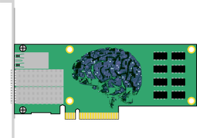

## ☃️ The Winter Coder

If you're looking for code, there's more over on [ GitLab][GitLabCRH].  I am currently focused on
[ Zambezi][Zambezi],
which is an [SMB3][WinSMB3] Offload Engine.

I started using GitLab a few years ago.  It's not as flashy as GitHub, but I
learned a few tricks and got used to it.  Moving back and forth between the
two is 90% easy and 10% annoying corner cases that trip me up.

### 🛠️ SMB/CIFS, SMB2/SMB3

**[Samba Team][SambaTeam] Member** 
I write code and share knowledge about Windows core network protocols,
particularly Server Message Block ([SMB][WikiPediaSMB]).  

  - [Implementing CIFS][ImpCIFS] 
    Long ago, I wrote a book about CIFS (aka SMB1).  Despite Microsoft
    having [deprecated SMB1][SMB1JoseB], the book is still relevant today
    and I, for one, still use it as a reference from time to time.
  - [[MS-CIFS]] and [[MS-SMB]] 
    A bit less long ago, I put together a team to write the CIFS
    specifications for Microsoft.  We wrote [[MS-CIFS]] from scratch and
    overhauled [[MS-SMB]].  The latter volume represents the additions and
    changes made to SMB1 starting with Windows 2000. 
  - [SMB3 Offload Engine][Zambezi] 
    These days I'm working on SMB2/3 integration with distributed file
    systems, and on SMB3 Offload.  I think it would be cool if the low-level
    message handling could be moved to a SmartNIC or similar device. 
    ◦ Compression and Encryption 
    ◦ Multichannel and Multi-protocol 
    ◦ Packet marshalling/unmarshalling 
    ◦ Direct I/O 
  - I started fiddling with [PeerDist][MS-PCCRC] a while back, but have not
    spent time on it in...well...years.  I plan to get back to it.
    Eventually.
 

### 🏰 My Fiefdom

- **The Home Network** 
  The network was once split between business and home.  There were two
  Soekris routers (remember those?) running [OpenBSD's][OpenBSD]
  [Packet Filter][PFilter] (pf), with routing in between.  It was a great
  setup, and I ran things that way for years.  More recently, I've combined
  down to a single network.  I run [OpnSense] on a [Protectli Vault][ProVault].
  OpnSense is easier to manage day-to day, but I miss being able to fine tune
  my firewall to meet my own picky specifications and preferences.
- **Firewall Futures**
  * I used to have uplinks to two disreputable behemoth ISP services.  That's
    down to one, now.  Two would permit load balancing and failover, which I
    would like to try.
  * I want to collect data at the firewalls, and coordinate with
    (anonymized) data from other firewalls to look for patterns.  You know,
    Big Data/AI stuff.
- **Reverse Proxy Web** 
  Slowly, but committedly, I'm spending free cycles building up a home web
  server with the goal of running a reverse caching proxy elsewhere on the
  'net and connecting the two via VPN.  I'm sharing this effort with a
  family member, who is an accomplished Software Developer in her own
  right.  Proud to be part of a cool family.
- **File Servers** 
  I have a set of [Linux MD RAID][LinuxRAID] based Samba fileservers that I
  run in my basement.  I use CentOS Linux Minimal and add what I need if I
  need it, but these systems don't need much.  Home, business, and personal
  storage and, of course, testing.
 

### 💡 Ideas

- **SMB3 NAS Offload Engine** 
  Top Project: [Zambezi] 
  
  The goal is to develop and standardize a sensible interface between the
  SMB3 Syntactic and Semantic layers, making it possible to offload the
  Syntactic part of the stack to a [SmartNIC] or [DPU].  The interface
  layer may also have relevance in direct memory-to-memory data transfer
  systems such as [SDXI].
  
- **SMB3 Python Toolkit** 
  [Carnaval] is an SMB2/3 toolkit in Python, aimed at
  building test cases and simple tools quickly and easily.  It also provides
  support for [NBT] transport.  Carnaval is written in Python 2, not Py3.
  The project has languished a bit over the years, but as Zambezi progresses
  the need for such a toolkit only increases.
- **Secure Overlay Network** 
  Back when I designed networks for the University of Minnesota, I became
  enamored of [Resilient Overlay Networks][WikiRON].  If you mix in some VPN
  capabilities, erasure codes, and clever routing algorithms, you might have
  something really cool--particularly in these work-from-home times.  There
  are certainly extant examples, like [tinc], which supports mesh
  networking. I'm looking into tinc, and others, to see what fits best.
  [OpnSense] supports tinc, so perhaps the job is done.  I feel the need to
  dig into the code a bit.
- **Wide Area Distributed Key/Value store**
  Key/Value stores are generally built for performance.  I'm interested in
  what happens when that model is extended over a wide area network,
  particularly a resilient mesh, as described above.  I think we'd need to
  add in some redundancy and possibly some form of journaling so that fenced
  nodes can recover cleanly.
  
- **PeerDist**
  This one keeps coming up time and again, and it's entangled with so much
  else... 
  [PeerDist][MS-PCCRC] is the protocol suite at the core of [BranchCache],
  which is a distributed caching system that Microsoft uses for web content,
  SMB3 files, and for software updates (see [BITS]).  I have created test
  code for working with PeerDist and BITS.  The next step would be polish up
  the PeerDist code, add PeerDistv2 support, and write the code for an Open
  Source Hosted Cache.  PeerDist combines all sorts of cool stuff, like
  Protocols, Data Storage, Key/Value Lookup, and Distributed Computing.
 

### Cool Hardware
- Kobol
- 2.5Gb switch
- Seed Board
- Good ol' Raspberry Pi
- DPU; eager to see what comes of it.

My desktop system is twelve years old.  My laptop is ten years old.  My
Chromebook is six months old but only because the old one broke.

Android dev?

### Reading

🤺
🚴
☕

<table align="center">
  <tr><td>
    Table Content.
  </td></tr>
</table>

  
  

  
  My most recent work is on <a href="https://www.gitlab.com/crh/"> GitLab</a>

  

  What if I put text here?
  Lots and lots and lots of text.  All sorts of text.  Much more text than I actually need.
  Lots and lots and lots of text.  All sorts of text.  Much more text than I actually need.
  Lots and lots and lots of text.  All sorts of text.  Much more text than I actually need.
   

 

$Id: README.md; 2020-09-22 17:02:57 -0500; crh$

<!-- Reference Links -->
[DPU]: https://en.wikipedia.org/wiki/Data_processing_unit
[NBT]: http://www.ubiqx.org/cifs/NetBIOS.html
[BITS]: https://docs.microsoft.com/en-us/windows/win32/bits/background-intelligent-transfer-service-portal
[SDXI]: https://www.snia.org/sdxi
[tinc]: https://www.tinc-vpn.org/
[MS-SMB]: https://docs.microsoft.com/en-us/openspecs/windows_protocols/ms-smb/f210069c-7086-4dc2-885e-861d837df688
[ImpCIFS]: http://ubiqx.org/cifs
[MS-CIFS]: https://docs.microsoft.com/en-us/openspecs/windows_protocols/ms-cifs/d416ff7c-c536-406e-a951-4f04b2fd1d2b
[OpenBSD]: https://www.openbsd.org/index.html
[PFilter]: https://www.openbsd.org/faq/pf/
[WikiRON]: https://en.wikipedia.org/wiki/Overlay_network#Resilience
[WinSMB3]: https://docs.microsoft.com/en-us/windows-server/storage/file-server/file-server-smb-overview
[Zambezi]: https://gitlab.com/ubiqx/zambezi
[Carnaval]: https://github.com/ubiqx-org/Carnaval
[MS-PCCRC]: https://docs.microsoft.com/en-us/openspecs/windows_protocols/ms-pccrc/51cb03f8-c0dd-4565-9882-aeb5ab0fa07e
[OpnSense]: https://opnsense.org/
[ProVault]: https://protectli.com/vault-4-port/
[SmartNIC]: https://blog.mellanox.com/2018/08/defining-smartnic/
[GitLabCRH]: https://www.gitlab.com/crh
[LinuxRAID]: https://raid.wiki.kernel.org/index.php/Linux_Raid
[SambaTeam]: https://www.samba.org/samba/team/
[SMB1JoseB]: https://docs.microsoft.com/en-us/archive/blogs/josebda/the-deprecation-of-smb1-you-should-be-planning-to-get-rid-of-this-old-smb-dialect
[BranchCache] https://docs.microsoft.com/en-us/windows-server/networking/branchcache/branchcache
[WikiPediaSMB]: https://en.wikipedia.org/wiki/Server_Message_Block
