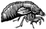

## ☃️ The Winter Coder

If you're looking for code, there's more over on [ GitLab][GitLabCRH].  I am currently focused on
[ Zambezi][Zambezi],
which is an [SMB3][WinSMB3] Offload Engine for SmartNICs.

I started using [
GitLab][GitLabCRH] a few years ago.  It's not as flashy as <a href="#">GitHub</a>, but I learned a few
tricks and got used to it.  Moving back and forth between the two is 90%
easy and 10% annoying corner cases that trip me up.

### 🛠️ SMB/CIFS, SMB2, and SMB3

**[Samba Team][SambaTeam] Member** 
I write code and share knowledge about Windows core network protocols,
particularly Server Message Block ([SMB][WikiPediaSMB]). 

  - [Implementing CIFS][ImpCIFS] 
    Long ago, I wrote a book about CIFS (aka SMB1).  Since then,
    Microsoft has [deprecated SMB1][SMB1JoseB], but the book is still
    relevant and I, for one, still use it as a reference from time to
    time.
  - [[MS-CIFS]] and [[MS-SMB]] 
    A bit less long ago, based on the strength of my CIFS book, I was
    asked to put together a team to write the SMB1 specifications for
    Microsoft.  We wrote [[MS-CIFS]] from scratch and overhauled
    [[MS-SMB]].  The latter volume represents the additions and changes
    made to SMB1 starting with Windows 2000.  Once again, SMB1 has been
    [rightly deprecated][SMB1JoseB] by Microsoft, but it's still in use
    in a lot of environments so it's really important to have a solid
    reference.
  - [SMB3 Offload Engine][Zambezi] for SmartNICs and DPUs 
    These days I'm working on SMB2/3 integration with distributed file
    systems, and on an SMB3 Offload Engine.  I think it would be cool if
    low-level encryption, compression, and basic message handling could be
    moved to a SmartNIC or similar device. 
    ‣ Compression and Encryption 
    ‣ Multichannel and Multi-protocol 
    ‣ Packet marshalling/unmarshalling 
    ‣ Proxy and Software-Defined Servers 
  - I started fiddling with [PeerDist][MS-PCCRC] a while back, but have not
    spent time on it in...well...years.  I plan to get back to it.
    Eventually.
 

### 🏰 My Fiefdom

- **The Home Network** 
  The network was once split between business and home.  There were two
  Soekris routers (remember those?) running [OpenBSD's][OpenBSD]
  [Packet Filter][PFilter] ([`pf(4)`][PFmanpage]), with routing in between.
  It was a great setup, and I ran things that way for years. More recently,
  I've combined down to a single network.  I run [OpnSense] on a
  [Protectli Vault][ProVault].  OpnSense is easier to manage day-to day, but
  I miss being able to fine tune my firewall to meet my own picky
  specifications and preferences.
- **Firewall Futures**
  * I used to have uplinks to two disreputable behemoth ISP services.  That's
    down to one, now.  Two would permit load balancing and failover, which I
    would like to try.
  * I want to collect data at the firewalls, and coordinate with
    (anonymized) data from other firewalls to look for patterns.  You know,
    Big Data/AI stuff.
- **Reverse Proxy Webserver** 
  Slowly, but committedly, I'm spending free cycles building up a home web
  server with the goal of running a reverse caching proxy elsewhere on the
  'net and connecting the two via VPN.  I'm sharing this effort with a
  family member, who is an accomplished Software Developer in her own
  right.  Proud to be part of a cool family.
- **File Servers** 
  I have a set of [Linux MD RAID][LinuxRAID] based Samba fileservers that I
  run in my basement.  I use CentOS7 Linux Minimal and add what I need if I
  need it, but these systems don't need much.  I use these systems for home,
  business, and personal data storage, and sometimes a bit of code testing.
  The next time I set up a storage server I want to give Ubuntu Server a
  spin.
 

### 💡 Ideas

- **SMB3 NAS Offload Engine** 
  Top Project: [Zambezi] 
  
  The goal is to develop and standardize a sensible interface between the
  SMB3 Syntactic and Semantic layers, making it possible to offload the
  Syntactic part of the stack to a [SmartNIC] or [DPU].  The interface
  layer may also have relevance in direct memory-to-memory data transfer
  systems such as [SDXI].
- **SMB3 Python Toolkit** 
  
  [Carnaval] is an SMB2/3 toolkit in Python, aimed at
  building test cases and simple tools quickly and easily.  It also provides
  support for [NBT] transport.  Carnaval is written in Python 2, not Py3.
  The project has languished a bit over the years, but as Zambezi progresses
  the need for such a toolkit only increases.
- **Secure Overlay Network** 
  Back when I designed networks for the University of Minnesota, I became
  enamored of [Resilient Overlay Networks][WikiRON].  If you mix in some VPN
  capabilities, erasure codes, and clever routing algorithms, you might have
  something really cool--particularly in these work-from-home times.  There
  are certainly extant examples, like [tinc], which supports mesh
  networking. I'm looking into tinc, and others, to see what fits best.
  [OpnSense] supports tinc, so perhaps the job is done, but I feel the need
  to dig into the code a bit. 
  
- **Wide Area Distributed Key/Value store**
  Key/Value stores are generally built for performance.  I'm interested in
  what happens when that model is extended over a wide area network,
  particularly a resilient mesh, as described above.  I think we'd need to
  add in some redundancy and possibly some form of journaling so that fenced
  nodes can recover cleanly.
- **PeerDist**
  This one keeps coming up time and again, and it's entangled with so much
  else... 
  [PeerDist][MS-PCCRC] is the protocol suite at the core of [BranchCache],
  which is a distributed caching system that Microsoft uses for web content,
  SMB3 files, and for software updates (see [BITS]).  I have created test
  code for working with PeerDist and BITS.  The next step would be polish up
  the PeerDist code, add PeerDistv2 support, and write the code for an Open
  Source Hosted Cache.  PeerDist combines all sorts of cool stuff, like
  Protocols, Data Storage, Key/Value Lookup, and Distributed Computing.
 

### 🔩 Cool Hardware

My desktop system is twelve years old.  My laptop is ten years old.  My
Chromebook is only six months old, but that's because the screen shattered
on my first Chromebook so I bought a new one.  I'm not really into hardware.
I'm into making software work well even on substandard hardware.

That said, there are some cool products that I've been eyeing:

- 
  The [Kobol Helios64](https://kobol.io/) would be a great little platform
  for testing out some of my SMB3 Offload ideas.  It'd also work as yet
  another home storage system.
- I like the look of the [Seeed Odyssey SBC][SeeedO].  I'm not sure yet
  exactly how I would use it, and how it would be an improvement over the
  Raspberry Pi I already have.
- So... at the core of many a [SmartNIC] is a [DPU]; Data Processing Unit.
  The DPU is quickly becoming a focus of attention in the industry, and I
  expect to see them invade motherboard territory in the not-too-distant
  future.  This is the _perfect_ environment for an SMB3 Offload engine (and
  NFS offload as well).
  + Fungible has a [stand-alone DPU][FungiDPU] which, if I read their
    marketing material correctly, would be added to a computer mainboard for
    a closer connection with the CPU, memory, etc.
  + More recently, NVIDA [announced their own DPU][NVidiaDPU] aimed at
    networking, storage, and security.
 

### 🏋 A Challenge

I have been kicked hard in the bike shorts by proprietary cycling computers.
The ones I have tried are closed-source and have no published API.  When
things go wrong, there is no recourse.  This is the Achilles' heel of these
expensive devices.  All of the problems I've had with them, including data
loss and other frustrations, are due to their closed, proprietary nature.

So I am looking for an open option.  Here's what I've found so far:

- **[Open Cycling Computer][OpenCycle]** 
  The project was quite far along, but appears to have fallen stagnant.
  Dang shame, given how much work went into it.  Perhaps it can be revived
  and updated, given a little time and attention.
- **[Open Bicycle Computer][OpenBike]** 
  Another project that has seemingly dried up.  Worth reviewing, though.
  
- **[Open Source Bike GPS][OpenGPS]** 
  A much more active Open Bike Computer project.  There are links in the
  ReadMe to hardware information.  This one looks quite promising.
- **[Pyloton]** 
  ...is much less ambitious than the other projects on the list, but I could
  learn a thing or two from the parts and pieces list alone.
- **[Golden Cheetah][GoldCheetah]** 
  Ride file analytics.  This would pair nicely with an open GPS device.
 

### 📖 Further Study

There isn't much time, given everything listed above, but it would be fun to
do a bit more learning.

- **Android Development** 
  You know... apps and such. 
  A long time ago I co-founded a project called [jCIFS] that eventually grew
  up to be an important tool for providing SMB1 access from Android devices
  (and lots of other platforms).  We never updated it for SMB2/3. If someone
  out there is interested I'm happy to provide some know-how.
- **A bit more about Docker** 
  I've done more than dabble, but I am really just an end-user.  The Windows
  Protocol Test Suites ([WPTS]) can be run from inside a Docker Linux image,
  so I guess it's a good time to get practical experience.
- Kubernetes, Ansible, Terraform... yeah, I need to fly in the cloud some more.
 

### 🤯 More Yet

☕ I enjoy [a decent cup o'tea](http://ubiqx.org/cifs/Appendix-A.html). 
🤺 For much of my life I was an active fencer. (Foil:C, Épée:D) 
🚴 These days I prefer to [ride a bicycle][Musette]. 
[][LinkedIn] You can find
me on [LinkedIn]. 
[][GitLabCRH] You can find
more stuff on [GitLab][GitLabCRH].

   
  
  

 

$Id: README.md; 2020-11-26 17:23:59 -0600; crh$

<!-- Reference Links -->
[DPU]: https://en.wikipedia.org/wiki/Data_processing_unit
[NBT]: http://www.ubiqx.org/cifs/NetBIOS.html
[BITS]: https://docs.microsoft.com/en-us/windows/win32/bits/background-intelligent-transfer-service-portal
[SDXI]: https://www.snia.org/sdxi
[tinc]: https://www.tinc-vpn.org/
[WPTS]: https://github.com/microsoft/WindowsProtocolTestSuites
[jCIFS]: https://www.jcifs.org/
[MS-SMB]: https://docs.microsoft.com/en-us/openspecs/windows_protocols/ms-smb/f210069c-7086-4dc2-885e-861d837df688
[SeeedO]: https://www.seeedstudio.com/ODYSSEY-X86J4105864-p-4447.html
[ImpCIFS]: http://ubiqx.org/cifs
[MS-CIFS]: https://docs.microsoft.com/en-us/openspecs/windows_protocols/ms-cifs/d416ff7c-c536-406e-a951-4f04b2fd1d2b
[Musette]: http://mplsmusette.squarespace.com/blog/2020/8/19/guest-post-my-thanks-to-the-cheerleaders
[OpenBSD]: https://www.openbsd.org/index.html
[OpenGPS]: https://github.com/vincent290587/stravaV10
[PFilter]: https://www.openbsd.org/faq/pf/
[Pyloton]: https://learn.adafruit.com/pyloton
[WikiRON]: https://en.wikipedia.org/wiki/Overlay_network#Resilience
[WinSMB3]: https://docs.microsoft.com/en-us/windows-server/storage/file-server/file-server-smb-overview
[Zambezi]: https://gitlab.com/ubiqx/zambezi
[Carnaval]: https://github.com/ubiqx-org/Carnaval
[LinkedIn]: https://www.linkedin.com/in/chrishertel/
[MS-PCCRC]: https://docs.microsoft.com/en-us/openspecs/windows_protocols/ms-pccrc/51cb03f8-c0dd-4565-9882-aeb5ab0fa07e
[OpenBike]: https://hackaday.io/project/1887-open-bicycle-computer
[OpnSense]: https://opnsense.org/
[ProVault]: https://protectli.com/vault-4-port/
[SmartNIC]: https://blog.mellanox.com/2018/08/defining-smartnic/
[FungiDPU]: https://www.fungible.com/dpu-platform/
[GitLabCRH]: https://www.gitlab.com/crh
[LinuxRAID]: https://raid.wiki.kernel.org/index.php/Linux_Raid
[NVidiaDPU]: https://nvidianews.nvidia.com/news/nvidia-introduces-new-family-of-bluefield-dpus-to-bring-breakthrough-networking-storage-and-security-performance-to-every-data-center
[OpenCycle]: https://opencyclingcomputer.eu/
[PFmanpage]: https://man.openbsd.org/pf
[SambaTeam]: https://www.samba.org/samba/team/
[SMB1JoseB]: https://docs.microsoft.com/en-us/archive/blogs/josebda/the-deprecation-of-smb1-you-should-be-planning-to-get-rid-of-this-old-smb-dialect
[BranchCache]: https://docs.microsoft.com/en-us/windows-server/networking/branchcache/branchcache
[GoldCheetah]: https://www.goldencheetah.org/
[WikiPediaSMB]: https://en.wikipedia.org/wiki/Server_Message_Block
